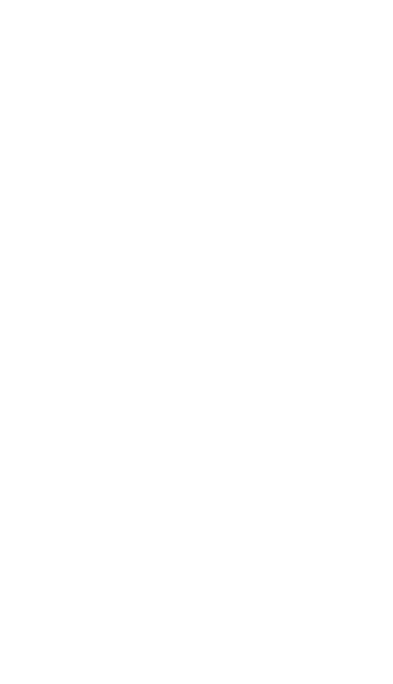

# Entrega prueba del camino básico

Entornos de Desarrollo - 1º DAw

## Grafo del flujo del programa

<picture>
<source media= "(prefers-color-scheme: light)" srcset=grafoPrograma.drawio.png>
<source media="(prefers-color-scheme: dark)" srcset=darkGrafoPrograma.drawio.png>

</picture>

## Complejidad ciclomática

### Cálculo de la complejidad ciclomática

  $$V(G) = \frac{aristas}{nodos} + 2$$

### Cálculo específico del programa
- El grafo del programa contiene:
    - 6 nodos
    - 8 aristas

$$ 
\text{V(G)} = \frac{8}{6} + 2 = 3,33
$$

- Es un programa sencillo sin mucho riesgo

## Caminos independientes

- Camino 1: 1 - 2 - 3 - 4 - 6
- Camino 2: 1 - 2 - 3 - 5 - 6
- Camino 3: 1 - 2 - 5 - 6

## Obtención de los casos de prueba

